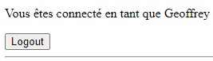

# svelte-firebase-todos-googleauth-example

Ce projet a pour objectif de montrer comment mettre en place une authentification avec le provider Google et Firebase.
Le projet se base sur l'autre repository [svelte-firebase-todos](https://github.com/geoiris/svelte-firebase-todos-example) qui montre comment mettre en place une application CRUD avec Svelte et Firebase.
En aucun cas l'auteur ne garantit la sécurité de ce code, il est fourni à titre d'exemple.

## Introduction

A la fin de l'implémentation vous saurez comment sécuriser une application svelte/firebase avec une authentification Google.

Vous pouvez aussi simplement cloner ce projet et l'utiliser comme base pour votre propre application.
Il vous suffira de changer les identifiants de votre base de données Firebase dans le fichier `.env`.

## Activation de l'authentification Google dans Firebase

Dans un premier temps nous allons nous rendre sur la console Firebase pour activer l'authentification Google.

1. Rendez-vous sur la [console Firebase](https://console.firebase.google.com/)
2. Sélectionnez votre projet
3. Cliquez sur "Créer > Authentication" dans le menu de gauche
4. Cliquez sur "Commencer"
5. Cliquez sur "Méthode de connexion"
6. Activez "Google" en renseignant l'email d'assistance associé.

L'authentification Google est maintenant activée pour votre projet Firebase. Nous devons configurer le domaine authorisé afin que notre application puisse accéder à la fonctionnalité d'authentification.

Pour cela, toujours dans la partie authentification de votre projet Firebase, cliquez sur "Paramètres".
Rendez-vous dans la section "Domaines autorisés" et ajoutez le domaine de votre application.
Dans le cas de cet exemple, il s'agit de `localhost`.


## Configuration de l'application

### récupération de l'authentification firebase

Je vais commencer par faire évoluer mon client Firebase afin de récupérer l'authentification.
Pour cela je vais importer `getAuth` depuis `firebase/auth` et l'utiliser pour récupérer l'authentification sur base de ma configuration d'application.

```typescript   
import { getAuth } from 'firebase/auth';

...

export const auth = getAuth(firebaseApp)
```

### Création d'un store pour gérer l'authentification

Afin de faire les choses proprements nous allons créer un store pour gérer l'authentification.
Je vais donc créer le fichier `src\stores\authGoogleStore.ts`.

Ce store va contenir les méthodes pour se connecter en PopUp et se déconnecter avec Google.
Il va également exporter un authStore qui contiendra les informations de l'utilisateur connecté.

```typescript
import { writable } from 'svelte/store'
import { auth } from '$lib/firebase'
import {
  signInWithPopup,
  GoogleAuthProvider,
  signOut,
} from 'firebase/auth'
import type firebase from  'firebase/auth'

  export const authStore = writable<{
    isLoggedIn: boolean,
    user?: firebase.UserInfo,
    firebaseControlled: boolean,
    data: any
  }>({
    isLoggedIn: false,
    firebaseControlled: false,    
    data: {}
  })

  export async function loginWithGoogle() {
    try {
      const provider = new GoogleAuthProvider()

      await signInWithPopup(auth, provider)
    } catch (e) {
      console.log(e)
    }
  }

  export async function logout() {
    await signOut(auth)
  }

export default {
  subscribe: authStore.subscribe,
  set: authStore.set
}
```

### Utilisation du store dans l'application

Nous allons maintenant utiliser ce store dans notre application.
Je vais créer un fichier layout qui sera utilisé par tout les pages et qui contiendra la surveillance d'un changement d'authentification afin de savoir si un utilisateur se connecte ou se déconnecte.

Pour cela je vais créer le fichier `src\routes\+layout.svelte`.

Nous allons importer la méthode onMount de svelte ainsi que nos differentes fonctions permettant de gérer l'anthenfication.

```typescript
<script lang="ts">
	import { onMount } from 'svelte';
	import { auth } from '$lib/firebase'
	import { onAuthStateChanged, type User } from 'firebase/auth';
	import { authStore, loginWithGoogle, logout } from '$stores/authGoogleStore';
</script>

<main>
    <slot />
</main>
```

Afin de savoir si nous sommes connecté, et si oui, avec quel utilisateur, nous alons ajouter un petit bloc de gestion dans notre layout. Nous pourrons exporter tout cela par la suite dans un composant à part entière.

Dans la partie script nous allons ajouter une variable `user` :

```typescript
	let user: User | null;
```

Puis dans la partie html nous allons ajouter un bloc conditionnel pour savoir si nous sommes connecté ou non :

```html
{#if user}
    <p>Vous êtes connecté en tant que {user.displayName} - {user.email}</p>
    <button on:click={logout}>Logout</button>		
{:else}
    <p>Vous n'êtes pas connecté.</p>
	<button on:click={loginWithGoogle}>Login with Google</button>
{/if}
<hr>

<main>
    <slot />
</main>
```

Ici nous venons exploiter notre variable user afin de savoir si nous sommes connecté ou non. Si nous le sommes, nous affichons les informations de l'utilisateur et un bouton pour se déconnecter. Sinon nous affichons un bouton pour se connecter.

Nous remarquons que le bouton de connexion est lié à la méthode `loginWithGoogle` et le bouton de déconnexion à la méthode `logout` de notre store Google.

A ce stade si nous cliquons sur le bouton de connexion, une popup s'ouvre pour nous connecter avec notre compte Google. C'est Google qui va gérer pour nous la validation du compte qui se connecte, l'utilisateur devra accepter les condition d'utilisation de l'application. Une fois connecté, la popup se ferme et nous sommes connecté à l'application mais nous n'avons pas encore géré le retour de l'authentification pour changer l'état de notre variable user. En revanche vous pouvez à ce stade constater dans la console firebase que votre utilisateur est bien créé.

Pour gérer le retour de l'authentification, nous allons utiliser la méthode `onAuthStateChanged` de firebase. Cette méthode nous permet de surveiller le changement d'état de l'authentification. Nous allons donc ajouter cette méthode dans notre layout au mount de la page.

```typescript
	onMount(async () => {
		onAuthStateChanged(auth, async(newUser) => {
			user = newUser;
			authStore.set({
				isLoggedIn: user != null,
				user: newUser,
				firebaseControlled: true,
			})		
		});
	});
```

Grace à cela, la variable user sera mise à jour à chaque changement d'état de l'authentification. Nous allons également mettre à jour notre store pour que les informations de l'utilisateur soient également mises à jour.

On constate immediatement que les informations de l'utilisateur sont mises à jour en temps réel. Si nous nous déconnectons, la variable user est mise à null et le bouton de connexion est de nouveau affiché.



## Conclusion

Nous avons vu comment mettre en place une authentification avec Google et Firebase dans une application Svelte. Nous avons également vu comment gérer le retour de l'authentification pour mettre à jour les informations de l'utilisateur connecté.

Ainsi grace à ces informations de connexion, nous pourrions par exemple gérer des droits d'accès à certaines pages de notre application. Nous pourrions également gérer des informations spécifiques à l'utilisateur connecté.

Dans le prochain module nous verrons comment mettre à profit cette authentification pour sécuriser l'écriture en base de données, car à ce stade, même si nous sommes connecté, n'importe qui peut écrire dans notre base de données. Nous verrons également une solution pour administrer une liste d'utilisateurs spécifique à travers une collection Firestore (présent dans la version payante de manière plus simple).

## Pour aller plus loin

Nous allons aller un peu plus loin pour faire en sorte que seule la page d'acceuil soit accessible si l'utilisateur n'est pas connecté.

Pour cela nous allons créer une page spécifique pour notre liste de tâches.

### Refactorisation de la page d'accueil

Nous allons créer le fichier `src\routes\todos\+page.svelte` :

```typescript
<script>
    import Todos from '$components/todos.svelte'
</script>

<Todos />
```

Nous allons refactoriser notre pour qu'elle contienne seulement un lien vers la page des tâches :

```html
<h1>Accueil</h1>

<a href="/todos">Tâches</a>
```

### Gestion des droits d'accès

Dans notre layout, nous allons maintenant gérer une liste de page autorisées si un utilisateur n'est pas connecté. Ainsi, seuls les utilisateurs connectés pourront accéder aux autres pages du site, ici à la gestion des tâches.

On commence donc par ajouter une variable de routes autorisées, en mode déconnecté, dans notre layout :

```typescript
    const nonAuthRoutes = ["/"];
```	

Ensuite dans le OnMount nous allons enrichir le code présent avec une vérification de la page courante et de l'utilisateur connecté :

```typescript
    onMount(async () => {
        onAuthStateChanged(auth, async(newUser) => {
            user = newUser;
            authStore.set({
                isLoggedIn: user != null,
                user: newUser,
                firebaseControlled: true,
            })	

            const currentPath = window.location.pathname;

            if (!user && !nonAuthRoutes.includes(currentPath)) {
                window.location.href = "/";
                return;
            }
        });
    });
```

Si vous vous déconnectez et que vous essayez d'accéder à la page des tâches, vous serez redirigé vers la page d'accueil.
Le comportement actuel n'est pas encore tout à propre, vous pouvez remarquer que la page des tâches est chargée avant la redirection. Nous allons donc refactoriser le if de vérification de l'utilisateur pour y ajouter le bloc <slot> seulement dans le cas où l'utilisateur est présent.

```html
{#if user}
    <p>Vous êtes connecté en tant que {user.displayName} - {user.email}</p>
    <button on:click={logout}>Logout</button>		
    <hr>
    <main>
        <slot />
    </main>
{:else}
    <p>Vous n'êtes pas connecté.</p>
    <button on:click={loginWithGoogle}>Login with Google</button>
{/if}
```